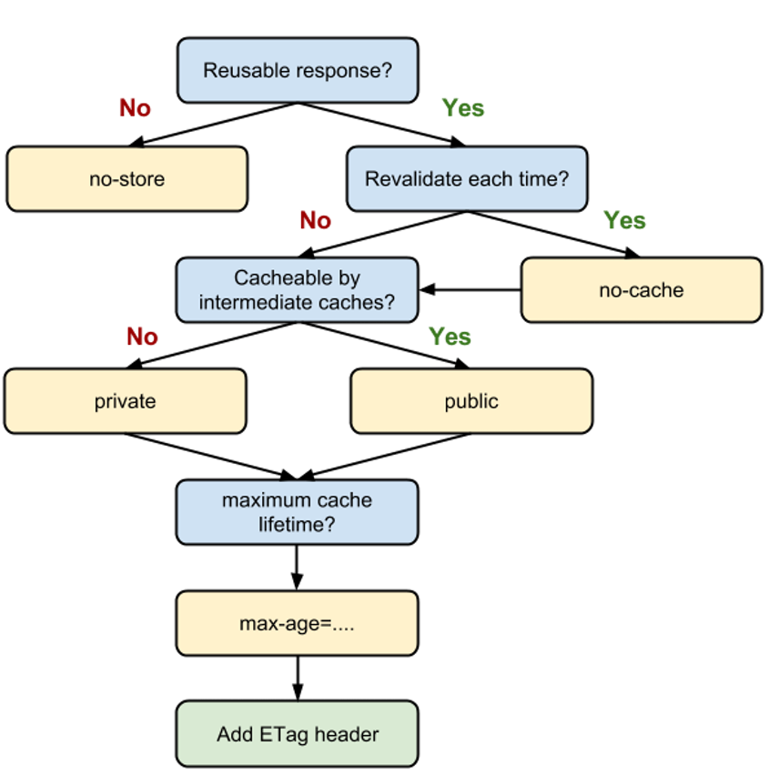
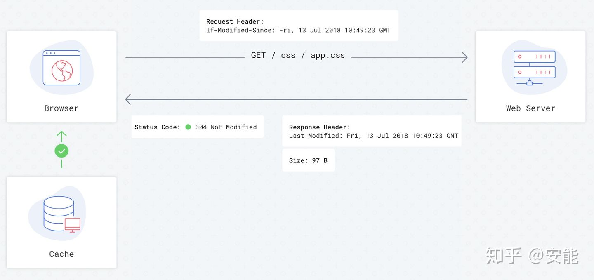
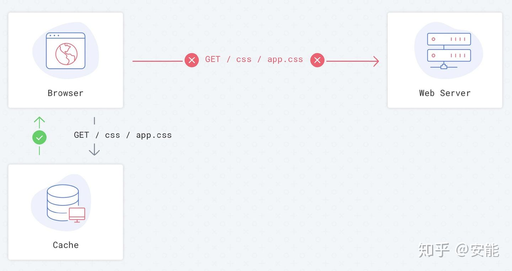
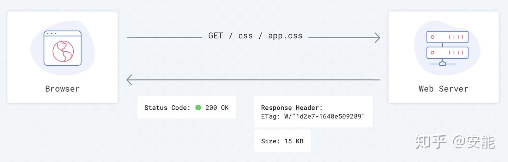

# 前端缓存

## 缓存定义

基本的网络请求的三个步骤：请求（前端） -> 处理（后端） -> 响应（前端）

缓存分类：

- 前端缓存：在请求和响应中进行
  - 在请求时，浏览器也可以通过存储结果直接使用资源，直接省去发送请求的步骤
  - 在响应时，通过浏览器和服务器共同配合，减少响应内容来缩短传输时间
- 后端缓存：主要在处理中进行
  - 在处理时，通过保留数据库连接、存储结果等缩短处理时间，尽快进入响应步骤

## 前端缓存分类

### 按缓存位置分类

查看某个请求的最终的处理方式：chrome 开发者工具 -> network 栏 -> 请求的 size 字段，比如：

1. from ServiceWorker
2. from memory cache
3. from disk cache
4. 实际的数据大小，如 1.8M、298K

> 注意：请求的优先级是从 1 到 4 的，找到即返回，否则继续按后面的处理方式查找

_浏览器请求资源时的过程_：
1. 调用service worker的fetch事件响应
2. 查看memory cache
3. 查看disk cache，若：
   - 若有强制缓存且未失效，则使用强制缓存，不请求服务器（200）
   - 若有强制缓存但已失效，则使用协商缓存，比较后确定是200还是304
4. 发送网络请求，等待网络响应
5. 若http头部配置一些属于缓存的字段，则把响应存入disk cache
6. 把响应内容的引用存入memory cache
7. 若service worker的脚本调用了`cache.put()`，则把响应内容存入service worker的cache storage

**_service worker_**：开发者编写的脚本，可以自行设置以进行灵活、直接的存储，操作的缓存有别于 memory cache 和 disk cache

位置：chrome 开发者工具 -> application 栏 -> cache storage 项

基本解释：

- service worker 的缓存是永久的，只有手动调用`cache.delete(resource)`或容量超过限制时，才会被浏览器清空
- 当未能命中 service worker 缓存，一般会使用 fetch()方法继续获取资源，此时就会去 memory cache、disk cache、实际网络请求中查找缓存，此时都会标注为 from serviceworker，根据情况，会把资源添加到缓存中，具体有：
  - 根据 service worker 中的 handler 决定是否存入 cache storage
  - 根据 http 头部的相关字段决定是否存入 disk cache
  - memory cache 中会保存一份资源引用，备下次使用

**_memory cache_**：内存缓存，操作系统原理是先读内存，再读硬盘

基本解释：

- 几乎所有网络请求都会被浏览器自动加入到 memory cache 中，由于数量巨大且浏览器占用内存不能无限扩大，导致 memory cache 是个短期存储，其中几乎所有网络请求分为 2 块：
  - preloader：浏览器打开网页时，会先请求资源，然后解析资源。preloader 的作用是一边解析执行资源（css/js），一边请求下一批资源（css/js）。这些请求过来的资源会被放入到 memory cache 中，供后面的解析执行操作使用
  - preload：显示指定的资源预加载，会放入到 memory cache 中，比如`<link rel="preload"/>`
- 一般情况下，浏览器关闭 tab 之后，该次浏览的 memory cache 便会失效（给其他 tab 腾出内存位置）；当页面缓存占用极多的内存时，在 tab 关闭之前，最先保存的一些缓存就失效了

作用：

- memory cache 保证一个页面中多个相同的请求，实际上只会被请求一次，避免资源浪费
- memory cache 在匹配缓存时，必须保证 url 相同、类型相同、cors 域名规则相同，才能被认定为相同的请求
- 在从 memory cache 中获取缓存时，浏览器会忽略`max-age=0`（含义：不要在下次浏览时使用）、`no-cache`等 http 头部配置，仍然从 memory cache 中读取。由于 memory cache 是短期使用，大部分情况生命周期仅是一次浏览，所以和`max-age=0`不冲突
- 若不想让一个资源读取任何缓存，需设置`no-store`字段

**_disk cache_**：硬盘存储，存在文件系统中

基本解释：

- disk cache 允许相同资源在跨会话、跨站点时重复使用
- disk cache 严格根据 http 头部配置判断资源是否可缓存、是否可用、是否已失效需重新请求
- disk cache（属于持久性存储）会面临容量增长问题，所以浏览器会使用某种算法把古老的、可能过时的一个个资源删除
- disk cache也叫http cache，遵守http协议字段，所以一些http字段设定的缓存、强制缓存、协商缓存（对比缓存）均属于disk cache

### 按失效策略分类

按失效策略分为：
- 强制缓存
- 协商缓存

**_强制缓存_**：客户端请求时，会先访问缓存数据库看缓存是否存在，存在则直接返回；不存在则请求服务并将响应结果写入缓存

基本解释：
- 强制缓存直接减少请求数量，是提升最大的缓存策略
- 强制缓存的优化覆盖了请求的三个步骤，若考虑使用缓存优化网页性能，应首先考虑
- 可造成强制缓存的字段有：
  - Expires（http/1.0）：表示缓存到期时间，是一个绝对时间（当前时间+缓存时间）
  - cache-control（http/1.1）：表示资源缓存的最大有效时间，是一个相对时间，在该时间内，浏览器不向服务器发送请求
- cache-control的优先级高于expirs，为了兼容性，实际项目中两者都会设置
- cache-control是相对时间，可保证服务器和客户端时间的一致性，并且他的可配置性也高

_Expires_：
- eg：`Expires: Thu, 10 Nov 2017 08:45:11 GMT`
- 由于是绝对时间，若对本地时间进行修改，将导致浏览器判断缓存失效，而重新请求资源
- 若时区和其他误差导致的客户端和服务器之间的时间不一致，也可能导致缓存失效
- 写法十分规范，若不按照格式写，将会使设置失效

_cache-control_：
- eg：`Cache-control: max-age=2592000`
- 常用属性值有：
  - max-age：此文件在本地缓存的有效时间，到期时应该重新验证，但无方法确保该段时间内服务器文件不会修改，为了让浏览器下载最新的文件，可使用一些构建工具，例如webpack，比如将hash值加入到文件中，此时对浏览器来说就是一个新的文件，就会从服务器获取新的，自然旧的缓存就没有了，适用于css、js、图片
  - must-revalidate：若超过了max-age设置的时间，浏览器必须发送请求，验证资源是否有效
  - no-cache：不意味着没有缓存，只是告诉浏览器在使用缓存之前先验证服务器上的资源，到期时必须重新验证；语义上表示下次请求时不要直接使用缓存而需要比对，并不对本地请求进行限制。故浏览器处理当前页面时，可以放心使用缓存；需要和ETag一起使用，浏览器将发送一个简单的请求验证文件状态，适用于html
  - no-store：真正的不要缓存，所有的都不缓存，每次请求资源时都会发送请求
  - public：所有内容都能缓存，包括客户端、代理（cdn）
  - private：所有内容只有客户端才能缓存，代理服务器不能缓存。默认值
- 所有的属性值可以混合使用，以逗号隔开，混合使用时，[优先级如下](https://web.dev/http-cache/)：
  - 

**_协商缓存_**（对比缓存）：当强制缓存失效时，就需要使用协商缓存，由服务器决定缓存内容是否失效

基本解释：
- 流程上，浏览器请求缓存数据库，返回一个缓存标识，之后浏览器拿该标识和服务器通讯。若缓存未失效，返回304表示可继续使用，若缓存失效，则返回新的数据和缓存规则，当浏览器响应后，再将规则写入缓存数据库中
- 协商缓存的请求数量和没有缓存时是一致的，但是优点是节省了响应体的体积（304的情况下）
- 协商缓存的优化覆盖了请求三个步骤的响应步骤，通过减少响应体体积，来缩短网络传输时间；所以比强制缓存提升的幅度小
- 协商缓存可以和强制缓存一同出现，作为强制缓存的一种后备方案
- 协商缓存的两组字段：
  - Last-Modified & If-Modified-Since
  - ETag & If-None-Match

_Last-Modified & If-Modified-Since_：
- 流程：
  1. 服务器通过Last-Modified告诉客户端资源最后一次被修改的时间
  2. 浏览器将该值和内容一起记录到缓存中
  3. 下次请求相同资源时，浏览器从缓存中找出该缓存，在请求头中将上次的Last-Modified的值写入到If-Modified-Since字段中
  4. 服务器对比两个字段，若相等，则表示未修改（304），否则表示修改（200）
- 缺陷：
  - 资源更新的速度是秒以下的单位，该缓存不能被使用，因为他的时间单位最低是秒
  - 文件是通过服务器动态生成的，则更新时间永远是生成的时间，尽管文件内容没有任何变化，所以该缓存不能被使用
  - last-modified是一个弱缓存头信息，浏览器有自己的缓存策略，会自行决定是否从缓存中获取资源/下载新文件
- 加载图：
  - 第一次加载
    
  - 第二次加载-完美情况
    
  - 第二次加载-通常情况
    

_ETag & If-None-Match_：
- ETag存储的是文件的特殊标识，服务器存储ETag字段，之后的流程和上者差不多，只不过是将Last-Modified换成了ETag，其他类似
- ETag的优先级高于Last-Modified
- 加载图：
  - 第一次加载
    
  - 第二次加载
    

_浏览器的行为_：指用户在浏览器如何操作时，会触发何种策略，有：
- 打开网页，输入地址：查找disk cache是否有匹配，有则使用，无则请求
- 普通刷新（f5）：因tab未关闭，会优先使用memory cache
- 强制刷新（ctrl+f5）：浏览器不使用缓存，故发送的请求头均有no-cache，直接返回200和最新内容

## 缓存的应用模式

*模式1：不常变化的资源*：`Cache-Control: max-age=31536000`
- 通常在处理该类资源时，会给他们的Cache-Control配置一个很大的max-age，这样在请求相同的资源时会命中强制缓存
- 为了解决更新的问题，须在文件名中使用hash、版本号、query参数等动态字符，达到修改引用url路径的目的，从而让之前的缓存失效（所以只要路径全称不同，则必然会请求新的资源，所以目前electron添加fromtab字段会影响url路径的改变）

*模式2：经常变化的资源*：`Cache-Control: no-cache`
- 这类资源的特点是url不变化，但内容经常变化，所以可以设置no-cache字段迫使每次请求时都向服务器验证资源是否有效
- 这种模式，节省的是请求体的大小，优化效果不如模式1

*模式3：两者结合（反例，非常危险）*：`Cache-Control: max-age=600, must-revalidate` <=> `Cache-Control: max-age=600`
- 表面上资源10分钟内使用缓存，10分钟后向服务器验证，实际暗藏风险，因为浏览器的缓存有自动清理机制、不同资源的请求时间也不尽相同
- 比如当有3种资源：index.html、index.css、index.js；在某次访问后，index.js被缓存清理，此时浏览器配上新的index.js+老的index.html+老的index.css一起展现，可能会因为版本不同，导致错误
- 比如a请求a.js、all.css，b请求b.js、all.css；若以a -> b的访问顺序访问，必然all.js的缓存时间早于b.js，所以之后访问b时，可能会发生all.css被缓存请求，浏览器此时会是新的all.css+老的b.js，导致版本不同的错误
- 若要使用max-age做强制缓存，则不要设置一个太短的时间，较短的max-age的用处：适合整站使用合并后的css和js（适合小型网站），否则可能会发生冗余，影响性能；适合资源是独立使用的，并不需要和其他文件配合生效的网站

## 缓存的方案

**_方案1_**：
- 使用构建工具（如webpack）将唯一的hash添加到css、js、图片路径上
- 对于js、css、图片，设置：`Cache-Control: public, max-age=31536000`，不设置ETag和Last-Modified
- 对于html，设置`Cache-Control: no-cache`和ETag

## 参考资料

1. [一文读懂前端缓存,知乎,小蘑菇小哥 ​](https://zhuanlan.zhihu.com/p/44789005)
2. [网站 cache control 最佳实践,知乎,安能](https://zhuanlan.zhihu.com/p/102394315)
